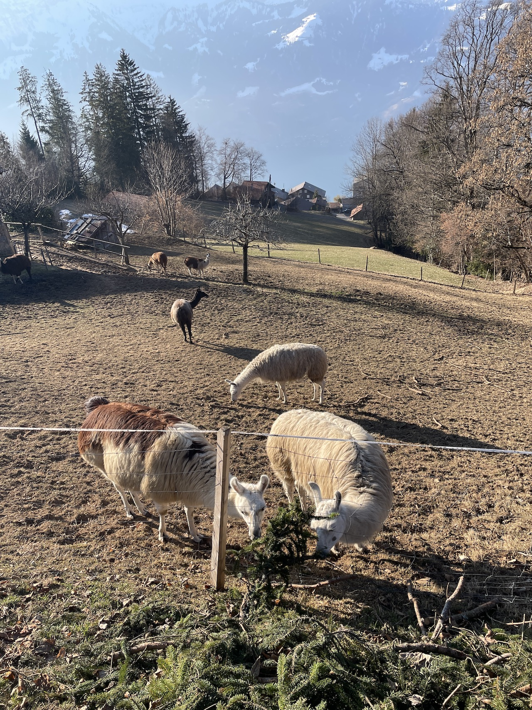

# 07. Mar 2022
## media^alps 4. - 6. March 2022
I had the honor to give a workshop at the [media^alps](https://www.instagram.com/media_alps/) event 2022. The weekend is traditionally organised by students of the major Modern Materials and Media of the [Conservation and Restoration](https://www.hkb.bfh.ch/en/conservation-and-restoration/) studies at [HKB](https://www.hkb.bfh.ch). It usually involves being in the swiss alps and nerding over some creative coding topic.

This year I gave an introduction to creative coding with [micro:bits](https://microbit.org/). These are tiny electronic circuit boards with tons of things like leds, buttons and sensors on it and a super easy coding platform.

I was super nervous as always, waking up several times the night before the workshop and thinking about it and preparing in my head. But… again as always, the participants were super nice, welcoming, interested and engaged. The workshop was broken up in 3 times 3h.

The first third was dedicated to the basic building blocks of a proper program (according to myself 😅):

- variables
- conditions
- loops
- functions

I led them through that dry and crusty part with little experimentation time. The second part was about building groups, coming up with a project and realise it until the evening. In my experience, coding is best learned through practice and real problems. The third and last part the next morning was dedicated to creating a little radio game for the hike later on, again in groups.

Here are some impression on their insta account (lots of photos of micro:bits):

- [https://www.instagram.com/p/CaxiLnxITlx/](https://www.instagram.com/p/CaxiLnxITlx/)
- [https://www.instagram.com/p/CaxidKfoVzo/](https://www.instagram.com/p/CaxidKfoVzo/)
- [https://www.instagram.com/p/CaxjCO5oJHX/](https://www.instagram.com/p/CaxjCO5oJHX/)

Next to the wonderful organisation-team, the fantastic participants, the incredible weather and view I also got valuable insights into the mindset and values of aforementioned study program, Conservation and Reservation. I have to say that I became kind of jealous and I probably would have loved to do this one instead of an MA in Design… I had a nice Talk with Sophia and Ralph, two senior students, about what makes up their studies.

Besides the obvious, conservation and restoration, whereas Modern Materials and Media concentrates on materials such as the various kinds of plastics and new media from film to software, I felt that they have a very strong sense of being a gang. I experienced them as a team, that sticks together, looks out and cares for each other. Part of that was probably that their field is so vast and can be so specific that you need to have good network of people knowing things and relying on each other. I haven't catched the specifics, but it seems that their studies is also strongly encouraging exchange and collaboration (hence the media^alps event).

They also caried with them very strong values, a caring practice and a respect before what is. I loved how Sophia explained me that you need to inquire, you need to question in order to know what is in front of you to be able to treat it with the right kind of care and respect. This aspect of [Care](notes/Care.md), maintenance, and repair is something I came across my research on aspects of [Animism](pages/Animism.md). I got a bunch of texts [in a folder in my library](https://www.zotero.org/groups/4323256/thgie_library/collections/9I8UA4ZN) on that subject. I bereave, that I was not able to convey this part to my supervisors in my MA studies. But it was a pleasure to meet this particular bunch of people and have a good chat with them about that subject. It felt good on many layers.

After all, despite having been nervous as shit (as usual), I'm absolutely happy that I was able to have had this experience. Makes me love people and the world.

*There were lamas!*

*The view from the place was absolutely breath taking*

*There was also a lot of sound nerding going on*

## More Things
- Read [Library as Infrastructure](reading/@matternLibraryInfrastructure2014.md), another fantastic text bei Shannon Mattern on libraries as socio-technological infrastructures.
